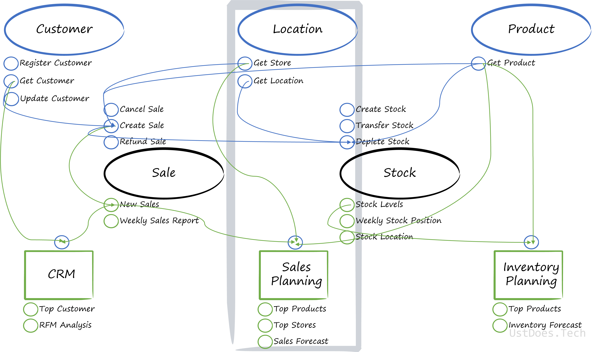
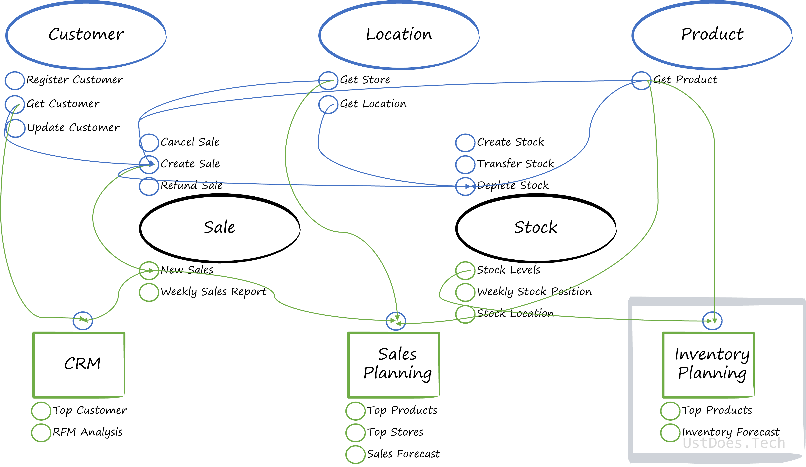

In previous posts we've understood what is [Data Mesh](../what-is-data-mesh/) and gone into [greater detail](../data-mesh-deep-dive/) with regards to the principles. In this next series of posts I want to use a fictional case study to explore how the underlying principles could work in practice. This post will introduce the fictitious company; the challenges it faces; and how the principle of decentralised data ownership and architecture, with domain alignment, would work.

## Fictitious Company: XclusiV

XclusiV is a luxury retailer operating in multiple countries. It has two divisions, which operate almost as separate businesses, which we will call Division X and Division V. The Point-of-Sale (POS) and Enterprise Resource Planning (ERP) systems within each market that it operates is the same for each division, but the POS and ERP systems can vary between markets.

Each division has their own stores but, occasionally, there are flagship XclusiV stores that house products and staff from both divisions.

The retail operations are supported by separate manufacturing and buying processes, separate marketing teams; as well as centralised distribution, IT, Finance, and HR capabilities.

## XclusiV Analytical Challenges

The analytical challenges that XclusiV faces can be summarised as follows:

- Centralised Data Warehouse that treats both divisions and all markets the same
- A central Data Engineering team that has limited capacity to support the development of new features requested by business teams
- Shadow IT has sprung up to try to overcome the capacity limitations of the Data Engineering Team but has created more confusion
- The business teams do not feel like they own the data
- Very few business teams want to own the data

We've got two themes for our challenges: poor analytical performance (which will impact business performance) and lack of data ownership.

Quality of data is quite good, so there isn't the usual data governance concerns, other than ownership.

## How could Data Mesh help?

Due to the lack of ownership of data, a data mesh might not be able to resolve the challenges at XclusiV. However, embarking on a journey which, ultimately, empowers users will go a long way to establishing data ownership within domains. 

The organisational structure doesn't make this a simple use case for data mesh. In other examples, there's a clear separation between domains: user domain; playlist domain; artist domain etc., but in this example, the separation between domains isn't so clean. I think one of the reasons why there's a clear domain separation in other examples is due to a microservices architecture. XclusiV haven't got around to implementing a microservices architecture and are still using line-of-business applications.  

We could separate domains into Sale, Product, Customer, Location, Stock etc., and that would work quite nicely if there was system alignment across markets (and that is a technological hurdle which shouldn't be insurmountable). The following diagram details the data flow from one domain to another with the operational capabilities in blue and the analytical endpoints in green. You'll notice that there's a fair few dependencies, and this is a simplified model.

Regardless of whether XclusiV has embraced microservices or retain LOB applications, the logical flow of data between arbitrary domains would be the same. But who should own what?

### Domain Ownership

Domains can span multiple subject areas and have many dependencies. Let's take Sales and Stock, as the driving forces for business - without stock, there's no sales. If there are no sales, there's no business.

#### Retail Operations Team

In this example, the operational capabilities and associated analytical endpoints for Sales and Stock domains come under the ownership of the Retail Operations Team. They're tightly aligned to the creation of data and with the operational analytical demands, like *Weekly Sales Report* and *Weekly Stock Position*. The team is responsible for the input of data, the quality of the data, and associated output.

>But surely the Retail Operations Teams is responsible for everything in the POS?

Yes, at the moment that is how XclusiV currently arranges its business. But the Retail Operations Team aren't actually that interested in domains like Customer, or Location, or Product - so why would they want to own it? The team is responsible for the day-to-day operations of the stores and not concerned with product development, customer relationships - that's the preserve of other teams.

#### Customer Relationship Team

Unsurprisingly, the Customer Relationship Team should own the Customer domain, as well as the CRM domain. 

The Customer Relationship Team wants to ensure that the right customers are targeted, that the right customer relationships are nurtured, and the quality of the customer data is accurate - specifically with regards to GDPR requests. A poor service, at any engagement point, will damage the reputation of XclusiV and reflect poorly on the Customer Relationship Team.

#### Finance

Finance are typically the gatekeepers for investment, as well as divestment. If sales are growing, there could be scope for opening up more stores or expanding product ranges. Conversely, if sales are not growing then stores could be closed and the product range could be more limited. Those decisions all rely upon Finance to make, with the advice from other departments.  

> What about the Sales Team? 

This is where it can get complicated. I recommend that it's Finance who own these domains as they make the final decision but I do recognise that there is a lot of overlap.

#### Sales Team

There is a lot of overlap between the Sales Team and the Retail Operations and the Finance Teams.

The Sales Team could be responsible for the Sales Planning Domain, but I argue that they are consumers of the domain as they are targeted by Finance on sales, rather than setting targets and driving decisions based on the data. Conversely, in another organisation it could be the Sales Team who owns the domain and Finance is the consumer.

#### Buying Team

The Buying Team are responsible for buying products for the various stores based on the trends and types of products that have performed well in the past and expected to perform well in the future. 

Therefore, the Buying Team owns the Inventory Planning Domain as it needs to plan for inventory it needs to buy. However, you'll notice that the Buying Team does not have ownership of the Product Domain. But who does?

#### Marketing

Marketing owns the Product Domain. Why Marketing and not Buying or Manufacturing? Because Marketing are most keenly interested in the product as they are entirely responsible for the success of a product, how it is marketed and it's performance (from a sales perspective). Owners of Product Domain but consumers of the Sales Planning Domain. Marketing sets the brief for products to be created.

Manufacturing is concerned about output and quality of the product but they're not that interested in the success of a product. Buying is concerned about the required inventory of the product, but not the product itself. That's why Marketing is, in my opinion, the correct owner of the Product Domain.

## Cross-Divisions

The examples above assume a single division - but we know that XclusiV is a multi-divisional organisation. How will it work with more than one division? We can have duplication of domains - to reflect the physical division of the organisation. This will also allow th organisation to scale if it decides to create or acquire new divisions or even divest divisions. 

XclusiV could re-organise and have shared domains across the divisions, but this would be counter to the principles of data mesh, as domains should be aligned to the organisation. In addition, to re-organise into shared domains across divisions wouldn't be scalable and would impose some of the same challenges and restrictions of the current analytical structure. 

For cross-divisional functions, like IT, we'll explore their role in [Self-Serve Analytical Platform Fictional Case Study: Retail](../self-serve-platform-case-study-retail/) and for cross divisional consumers, like Group Finance, we'll explore how they would consume data in [Data Product Fictional Case Study: Retail](../data-product-case-study-retail/)
