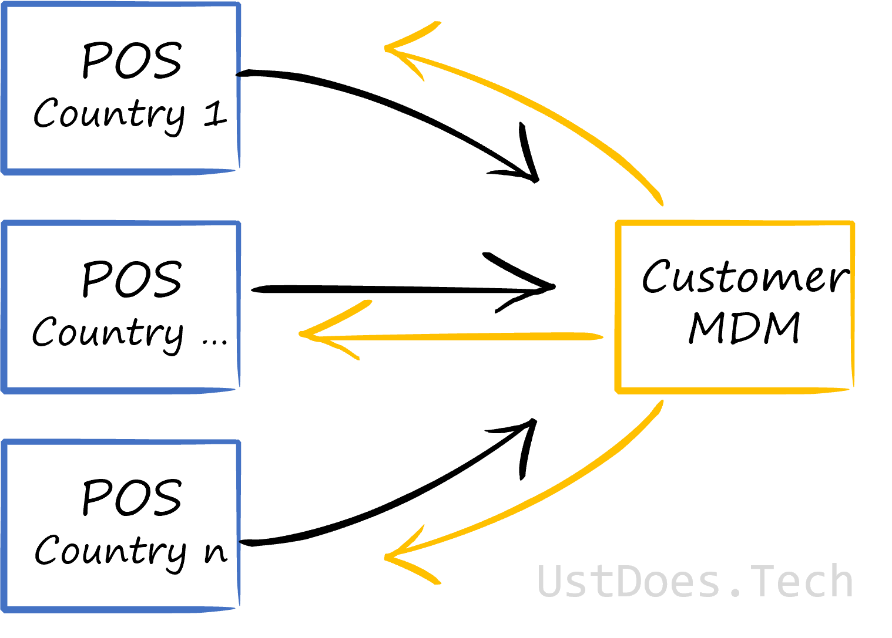

## Background

In a previous post, we explored what the [data domains](../data-domain-case-study-retail/) could look like for our fictional retailer - XclusiV. In this post, we will explore how the data products could work in this fictional case study, including how pure data consumers would handle the data - particularly those consumers who have a holistic view of an organisation (also a group of consumers for whom a traditional analytical model is perfect).

We won't go through every domain identified in the previous post, instead we'll focus on the Customer Domain and the data consumers of Group Finance and Senior Management.

As a reminder, below is our hypothetical flow of data between the domains established in the previous post:

## Customer Data Product

A [Data Product](../data-mesh-deep-dive/#data-products) is the smallest component of a data mesh, composed of the ***code*** used to process and serve data; the ***data*** that is consumed as a product, along with its metadata; and the ***infrastructure*** upon which the code is deployed and the data, as a product, is stored.

A domain can have many data products, just like it might have many operational data sources and systems.

In our Customer Domain, we have the Customer information in the source applications and the Customer information in the CRM application, as highlighted in the below image.

But the reality of data flows for the customer domain are likely to be more complex than that, just because there are customers coming from different source applications and there's a business need to ensure that the data is mastered and we have a golden source of data for customers. This is to ensure that Customer A, who habitually shops in Country A can have the same experience when they shop in a different country and get assigned a different Customer ID.

At this point, our data product could be the Master Data Management (MDM) tool for Customer as it can be used by other solutions - not just those owned by the Customer Relationship Team. Like any good MDM tool and process, we want that data to flow back to originating source systems so that they have accurate and up-to-date data.

Other teams and systems can also subscribe to the data in the MDM tool but there's potential that the customer data and associated metrics can become distorted by teams and processes that don't have the same intimate knowledge of the data as the Customer Relationship Team.

Ownership of customer information resides with the team, so they should provide some analytical capabilities, such as serving a dimension for traditional consumers, or more interesting insights. Even if these are only used for the team's own purpose, it is still providing value.

Some of the analytical capabilities the team may offer, such as providing a view of segmentation by other domains, e.g. Product, will need to consume and transform data from other domains.

This is OK - mainly because the data isn't being strictly duplicated as the context of the data is changing. The context is changing from `this is a product` in the product domain to `product preference` as a customer attribute.

Therefore, in the customer domain we have the following potential data products:

- Customer Mastered Data
- Customer Dimension
- Customer Segmentation
- Segmentation by {Domain}

## Group Finance Data Product

Group Finance, in the traditional analytical model, are heavy users of analytical data. They need to know exactly how each unit within a business is performing, often making investment / divestment decisions based on the performance of individual units and the group as a whole.

But Group Finance are often consumers of data, rather than providers of data - other than as aggregated, formatted datasets to senior management.

Remember that a data product has the following core principles associated with it:

- Discoverable
- Self-describing
- Addressable
- Secure
- Trustworthy
- Interoperable

### Discoverable

Discoverable data means that a user can go into a tool, search for a term e.g. *customer* or *profit margin* and have everything related to that search term returned to them.

### Self-Describing

Once discovered, the data needs to tell the user what structure it is, the quality of the data within, ownership, lineage etc., and all of this is held within metadata.

### Addressable

Now discovered and described, users need to be told where the data is and have the potential to access it consistent. Much like a request to an IP address.

### Secure

Users in the organisation know that sensitive information can be found in certain datasets and they know where they can be found. However, not everyone should or need to have access to all data. Therefore it needs to be secured.

### Trustworthy

Now that a user has access to data, they need to be assured of its accuracy and trustworthiness. Too often, too much time is spent by users reconciling and verifying data because they do not trust it. Therefore, the data products need to assure users that it can be trusted.

### Interoperable

Interoperability of data means it should interact well with other data from other domains. This means that the data is useful outside its context and domain. If it's just bound to the domain it can't be used as a product to be consumed.

In most cases, as a consumer, all of those principles should be satisfied. But there might be times were a consumer needs to take that data and create something new.

Therefore, the data product for Group Finance can go in one of two ways:

1. Data Virtualisation
2. Domain Consolidation

### Data Virtualisation

Data virtualisation allows users to retrieve data from the various domains without physically moving the data. The data still resides, physically, with the domains.

There is a risk here that the data provided by domains isn't what is actually required by Group Finance and there is additional work to interpret the data. But in the data mesh, this is covered by a federated governance model which governs how data is provided and places the consumer (in this case Group Finance) at the core of service and requests.

Data Virtualisation would allow Group Finance to aggregate and format datasets to senior management in a way very similar to how they would in an analytical model; as well as providing them with the flexibility and agility of decoupling data pipelines from a central team and devolving that responsibility to domain teams.

With the domain using data virtualisation to consume data, the data product here are the queries to bring the data together, as well as the reports to visualise and share the data.

### Domain Consolidation

Domain Consolidation is traditional analytics but, instead of taking the raw data from all the different domains, applying cleansing and transformations, and producing an enterprise view of the data - we're taking the domain views of their data, in the form of served dimensions, and consolidating it into a consolidated view.

This consolidated view doesn't necessarily mean a conformed view, as it can still retain the language of the domains for attributes. However, it could mean the change in context for the transactional elements of domains, such as sales. While the dimensions would be consolidated and could still reside in their domains (similar to Data Virtualisation), the facts would be transformed into a new context - with links to the dimensions. In effect, these facts would be conformed, as well as consolidated.

In this use case, there would either have to be new data created in the Group Finance domain to justify duplicating data and effort - such as supplementing the data with profit and loss, or there has been a breakdown in trust between domains and the federated governance model isn't working.

The preference in most cases would be for pure consumers of data to employ data virtualisation because there would be fewer data management overheads than the alternatives. However, where there is a need to create new data - then there can be a strong case for physically consuming data from other domains.

## Conclusion

We've established what data products could look like for a single domain, as well as established how more traditional users of data would interact with the products - with a preference for data virtualisation.
