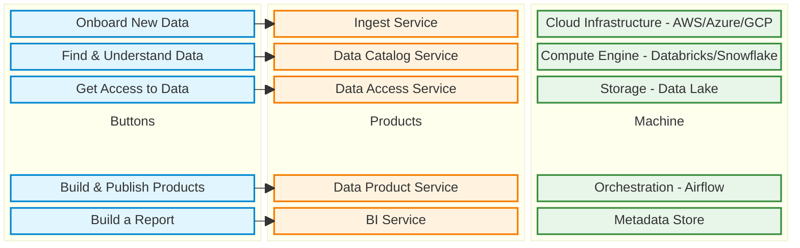

## Have you ever read a book that has changed your life? I have.

[Good Services](https://good.services/) by Lou Downe is one of those books. I started reading it during the Autumn half-term, and it gave me ideas to apply to the data world.

The data world is much maligned because most teams operate behind IT tickets or are so focused on the tools and technologies that make up a platform that they forget about the services they provide to their customers.

We’ve all been there, often on either side of the table. A “simple” request comes in, which in turn needs to be understood before it can be accepted. Then, it needs to be prioritised against other requests before it can be delivered. This ticketing model is unsustainable and unsatisfactory for everyone. It only exists because many of us have forgotten that we are providing a service, not just a platform or a product.

## So, what is a Service?

Very simply, a service is something that helps someone do something—a wrapper for a product.

In more detail, a service should: be easy to find, clearly explain its purpose, set a user’s expectations, enable users to complete the outcome they set out to achieve, work in a familiar way, require no prior knowledge to use, be agnostic of organisational structures, require the minimum possible steps to complete, be consistent throughout, have no dead ends, be usable by everyone equally, encourage the right behaviours from users and service providers, quickly respond to change, clearly explain why a decision has been made, and make it easy to get human assistance.

And if you want even more detail, go [buy and read the book](https://amzn.eu/d/fHd5xkV).

## Introducing SODA: Service-Oriented Data Architecture

There is a solitary post about SODA from 2023 ([SODA: Leveraging Service Oriented Data Architecture by Ronak Shah](https://medium.com/@ronyinusc/soda-leveraging-service-oriented-data-architecture-ab41cb371f0b)), which is really about applying [Service-Oriented Architecture](https://en.wikipedia.org/wiki/Service-oriented_architecture) (SOA) principles to data. There’s lots of good stuff in SOA, and you'll see some of it in SODA. However, we're not taking the tech-first approach of SOA; we're applying the Service Design principles mentioned above—which are people-first—to data architecture.

Why? Because if people cannot or will not use your product, you have a problem—no matter how great the underlying technology is.

### The Shadow IT Threat

If your service is hard to use, your users won't stop needing data. They'll just stop asking you. They will build their own Shadow IT hellscape in Excel, relying on emailed CSVs and vlookups, and that is a failure of your service design.

Even when it comes to the platforms and products we build, we speak about them in a tech-centric way. "My platform's powered by Databricks." So what? We've all seen, and probably contributed to, data strategy slides that are just a shopping list of technologies. As data professionals, we need to care about the technology because it underpins what we do and how we do it. Our customers? They don't give a shit.

Got a Kafka stream? Great—you have a Product. But what your customers want is not Kafka, but a "real-time ingestion service." That noun—real-time ingestion service—comes with preconceived expectations.

## Managing those expectations is the difference between a happy customer and a support ticket.

If you call it a "Real-Time Service" but the data only updates every four hours, you have failed. Part of service design is clearly stating the limitations. If the vending machine is out of Coke, it needs to tell you before you put your money in. If your ingestion service takes two weeks to set up, be honest about it. A slow service is annoying; a lying service is fatal.

I could issue simple guidance stating that "a good SODA design falls into three services: ingestion, processing, and serving," but all I would be doing is reskinning the Medallion Architecture, which we all know isn't an architecture.

A good SODA design relies upon you deciding which discrete services you're going to provide to your customers, setting those expectations, and allowing them to complete their intended outcomes. I will give you some ideas about what to call your services because setting out my stall and then saying "good luck" is a big "fuck you," and I want to provide a good service.

## The Difference in Practice

To prove why this isn't just semantics, let's look at a typical interaction: onboarding a new dataset.

### The Old Way (The Ticket): 

A user raises a ticket titled "Ingest Marketing Data." The Data Engineer picks it up four days later and comments: "Is it JSON or Parquet? What's the schema evolution policy?" The user, who just wants to calculate ROI, has no idea. Email tennis ensues. Two weeks later, a pipeline is built. It breaks three days later because the file format changed. Everyone is unhappy.

### The SODA Way (The Service): 

The user navigates to "Onboard New Data." The service asks: "Where is the file?" and "How often does it arrive?" The user uploads a sample. The service automatically detects the schema, validates the format, and tells the user: "Great, we'll process this every day at 9 AM."

The technical outcome is the same—data lands in the lake—but the experience is night and day. One is a chore; the other is a service.

## Service Decomposition

Our platform, as a whole, is a service, but it is also made up of smaller, discrete services. Think about a vending machine. It is the platform (The Kitchen), and it provides the service of issuing products you have bought. The products themselves provide a service—a can of Coca-Cola provides you with hydration, caffeine, and sugar-high services.

Here is what the SODA Stack looks like when we map it out:

**Important**: The arrows connecting the "products" to the "machine" aren't displayed as it would just be a mess.

With that in mind, let's look at some potential (and hopefully common) services from "The Products."

### The Ingest Service aka "Onboard New Data"

"A standardised framework for bringing data from operational systems to the lake. It handles connections, schema detection, and scheduling automatically."

### The Data Product Service aka "Build & Publish Data Products"

"The 'factory' for creating data products. It runs tests, compiles code, and publishes the product as a certified 'Data Product.' It stops users from pushing untested code to production."

### The Data Access Service aka "Get Access to Data"

"While most data teams won't have direct responsibility for this service, as it's your identity management tech, this service manages the workflow of requesting and granting access, ensuring audit trails for compliance."

### The Data Catalog Service aka "Find & Understand Data"

"The data search engine, aggregating metadata to show users what data is available and how trustworthy it is."

### The BI Service aka "Build a Report"

"Our favourite service, or at least mine. This is where most people will consume data and where a poor visualisation choice can make or destroy your entire service. This service provisions workspaces and semantic layers, ensuring metrics are defined in code and preventing report sprawl."

## Who Runs the Machine?

You cannot have a service without a Service Owner. The vending machine needs someone to restock the sodas and fix the coin slot when it jams.

In a SODA model, we stop being "Data Engineers" who pick up tickets from a backlog, and we become Service Owners responsible for the uptime, quality, and user experience of our specific domain. If the "Ingest Service" is confusing to use, that is on the Service Owner to fix—not the user to figure out.

## Nouns are useful, verbs drive action

We have our rudimentary services—you may have more or fewer, perhaps with different names—but they're still tech-centric. To make our services people-centric, we need to wrap them in verbs so that our customers know how to use them.

|The Tech (Noun) | The Service (Verb) |The User Goal|
|---| ----|---|
|Ingestion Service|Onboard New Data|"I have a file, I need it in the lake."|
|Data  Service| Find & Understand Data| "Does this data exist?"|
|Data Access Service| Get Access to Data| "Let me see the data."|
|Data Product Service|Build & Publish Products|"I've cleaned this data, I want to share it."|
|BI Service|Build a Report|"I need to visualise the trend."|

## What's Next?

The next bit is easy (hard). All you have to do is convince a room full of engineers to stop obsessing over the latest shiny tech and start obsessing over their users.